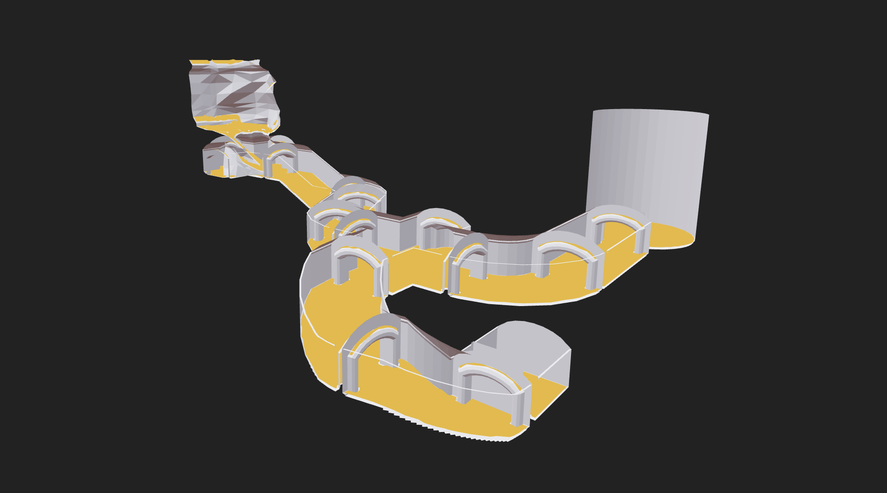

[](https://www.npmjs.com/package/recast-navigation)

[](https://www.npmjs.com/package/recast-navigation)
[](https://bundlephobia.com/result?p=recast-navigation)

# recast-navigation-js

### [Try the NavMesh Generator Website!](https://navmesh.isaacmason.com/)

- 📐 ‎ NavMesh generation
- 🧭 ‎ Pathfinding
- 🧑‍🤝‍🧑 ‎ Crowd simulation
- 🚧 ‎ Temporary obstacles
- 🌐 ‎ Web and Node support
- 💙 ‎ TypeScript friendly
- 🖇 ‎ [Easy integration with three.js via @recast-navigation/three](https://github.com/isaac-mason/recast-navigation-js/tree/main/packages/recast-navigation-three)

## Overview

**recast-navigation-js** is a WebAssembly port of [the Recast and Detour libraries](https://github.com/recastnavigation/recastnavigation). Recast is a state of the art navigation mesh construction toolset for games, and Detour is a path-finding and spatial reasoning toolkit.

This library provides high level APIs that make it easy to get started creating navigation meshes, querying them, and simulating crowds. It also provides lower-level APIs that give you fine-grained control over the navmesh generation process. 

> **Warning** This library is still in early development. Versions in the 0.x.x range may have breaking changes.

## Installation

This package ships as ECMAScript modules, and is compatible with Node.js and browser environments.

**CDN**

```html
<script type="module">
  import { generateSoloNavMesh } from 'https://www.unpkg.com/@recast-navigation/core@0.7.1/dist/index.es.js';
</script>
```

**NPM**

```sh
npm install recast-navigation
```

If you are using Vite, you may need to opt `recast-navigation` out of pre-bundling:

```js
export default defineConfig(() => ({
  optimizeDeps: { exclude: ['recast-navigation'] }
)}
```

## Usage

### Initialization

Before you can use the library, you must initialize it. This is an asynchronous operation.

Calling `init()` after the library has already been initialized will return a promise that resolves immediately.

```ts
import { init } from 'recast-navigation';

await init();
```

### Generating a NavMesh

To create a NavMesh, you can use the `generateSoloNavMesh` and `generateTiledNavMesh` functions.

The input positions and indices should adhere to OpenGL conventions:

- Use the right-handed coordinate system
- Indices should be in counter-clockwise winding order
- The `positions` and `indices` arguments should be flat arrays of numbers

```ts
import { generateSoloNavMesh } from 'recast-navigation';

const positions = [
  /* flat array of positions */
  /* e.g. x1, y1, z1, x2, y2, z2, ... */
];

const indices = [
  /* flat array of indices */
];

const navMeshConfig = {
  /* ... */
};

const { success, navMesh } = generateSoloNavMesh(
  positions,
  indices,
  navMeshConfig
);
```

If you need to do something more advanced, you can use the lower level API to create your own NavMesh generator. See the "Advanced Usage" section for more information.

### Querying a NavMesh

```ts
import { NavMeshQuery } from 'recast-navigation';

const navMeshQuery = new NavMeshQuery({ navMesh });

/* get the closest point on the NavMesh to the given position */
const position = { x: 0, y: 0, z: 0 };
navMeshQuery.getClosestPoint(position);

/* get a random point around the given position */
const radius = 0.5;
navMeshQuery.getRandomPointAround(position, radius);
```

### Crowds and Agents

First, create a `Crowd` instance.

```ts
import { Crowd } from 'recast-navigation';

const maxAgents = 10;
const maxAgentRadius = 0.6;

const crowd = new Crowd({ maxAgents, maxAgentRadius, navMesh });
```

To update the crowd, first set a timeStep, then call `update` each frame with the delta time.

```ts
const dt = 1 / 60;
crowd.timeStep = dt;

// you should call this every frame
crowd.update(dt);
```

Next, you can create and interface with agents in the crowd.

```ts
const initialAgentPosition = navMeshQuery.getRandomPointAround(
  { x: 0, y: 0, z: 0 }, // position
  2 // radius
);

const agent = crowd.addAgent(initialAgentPosition, {
  radius: 0.5,
  height: 0.5,
  maxAcceleration: 4.0,
  maxSpeed: 1.0,
  collisionQueryRange: 0.5,
  pathOptimizationRange: 0.0,
  separationWeight: 1.0,
});

/* get information about the agent */
const agentPosition = agent.position();
const agentVelocity = agent.velocity();
const agentNextTargetPath = agent.nextTargetPath();
const agentState = agent.state();
const agentCorners = agent.corners();
const agentParameters = agent.parameters();

/* tell the agent to move to a target position */
const targetPosition = { x: 0, y: 0, z: 0 };
agent.goto(targetPosition);

/* reset the agents target */
agent.resetMoveTarget();

/* teleport the agent to a position */
agent.teleport(targetPosition);

/* update some parameters of the agent */
agent.updateParameters({
  maxAcceleration: 4.0,
});

/* set all parameters for an agent */
agent.setParameters({
  // any omitted parameters will be set to their default values
});

/* remove the agent */
crowd.removeAgent(agent);
```

### Temporary Obstacles

Recast Navigation supports creating Box and Cylinder obstacles.

Note that in order to use obstacles, you must create a TileCache.

`TileCache` assumes small tiles (around 32-64 squared). Using `tileSize` values outside this range may result in unexpected behaviour.

```ts
import { generateTileCache } from 'recast-navigation';

/* create a tile cache */
const { success, navMesh, tileCache } = generateTileCache(positions, indices, {
  /* ... */
  tileSize: 16,
});

/* add a Box obstacle to the NavMesh */
const position = { x: 0, y: 0, z: 0 };
const extent = { x: 1, y: 1, z: 1 };
const angle = 0;
const boxObstacle = tileCache.addBoxObstacle(position, extent, angle);

/* add a Cylinder obstacle to the NavMesh */
const radius = 1;
const height = 1;
const cylinderObstacle = tileCache.addCylinderObstacle(
  position,
  radius,
  height,
  angle
);

/* update the NavMesh to reflect obstacle changes */
tileCache.update(navMesh);

/* remove the obstacles from the NavMesh */
tileCache.removeObstacle(boxObstacle);
tileCache.removeObstacle(cylinderObstacle);
```

### Debugging

You can use `getDebugNavMesh` to get a debug representation of the NavMesh.

```ts
const debugNavMesh = navMesh.getDebugNavMesh();

const { positions, indices } = debugNavMesh;
```

If you are using `@recast-navigation/three`, you can use `NavMeshHelper` and `CrowdHelper` to visualize NavMeshes and Crowds.

### Exporting and Importing

A NavMesh and TileCache can be exported and imported as a Uint8Array.

```ts
import { exportNavMesh, importNavMesh } from 'recast-navigation';

/* exporting */
const navMeshExport: Uint8Array = exportNavMesh(
  navMesh,
  tileCache // optional
);

/* importing */
const { navMesh, tileCache } = importNavMesh(navMeshExport);
```

### Advanced Usage

This library provides low-level APIs that aim to match the recast and detour c++ api, allowing you to create custom navigation mesh generators based on your specific needs. See: https://github.com/isaac-mason/recast-navigation-js/tree/main/packages/recast-navigation-core/src/generators

Please note that this functionality is experimental, and not all everything is exposed. Familiarity with the recast and detour C++ libraries is required. If you require unexposed functionality, please submit an issue or a pull request.

<!-- REMOVE-FROM-DOCS-START -->

## API Documentation

Documentation can be found at [https://docs.recast-navigation-js.isaacmason.com](https://docs.recast-navigation-js.isaacmason.com).

<!-- REMOVE-FROM-DOCS-END -->

## Examples

Some demonstrations of how to use the library in different environments can be found in the [examples](./examples) directory.

There are also storybooks that demonstrate the library in action: [https://recast-navigation-js.isaacmason.com](https://recast-navigation-js.isaacmason.com). The source code for the storybooks can be found in [./packages/recast-navigation/.storybook/stories](./packages/recast-navigation/.storybook/stories).

## Packages

Functionality is spread across packages in the `@recast-navigation/*` organization, with the `recast-navigation` acting as an umbrella package.

You can choose between picking the scoped packages you need, or using the umbrella `recast-navigation` package, which provides additional entrypoints for specific frameworks and libraries.

All packages ship as ECMAScript modules, and are compatible with Node.js and browser environments.

### [**`recast-navigation`**](https://github.com/isaac-mason/recast-navigation-js/tree/main/packages/recast-navigation)

[](https://www.npmjs.com/package/recast-navigation)

The umbrella package for `recast-navigation`.

```bash
> npm install recast-navigation
```

### [**`@recast-navigation/core`**](https://github.com/isaac-mason/recast-navigation-js/tree/main/packages/recast-navigation-core)

[](https://www.npmjs.com/package/@recast-navigation/core)

The core library!

```bash
> npm install @recast-navigation/core
```

### [**`@recast-navigation/three`**](https://github.com/isaac-mason/recast-navigation-js/tree/main/packages/recast-navigation-three)

[](https://www.npmjs.com/package/@recast-navigation/three)

Helpers for three.js.

```bash
> npm install @recast-navigation/three
```

## Apps

### [NavMesh Generator](https://navmesh.isaacmason.com/)

A website for generating navmeshes for your game. Drag 'n' drop your GLTF, fine tune your settings, and download your navmesh!

([source](./apps/navmesh-website/))

## Acknowledgements

- This would not exist without [Recast Navigation](https://github.com/recastnavigation/recastnavigation) itself!
- The demos use recastnavigation's level mesh
- The WASM build was based on the [Babylon.js Recast Extension](https://github.com/BabylonJS/Extensions/tree/master/recastjs)
